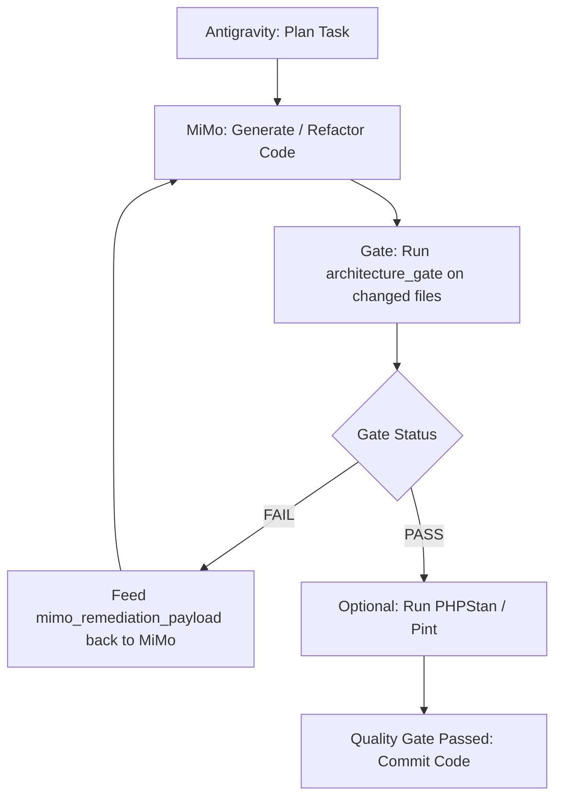

# Laravel Code Pattern MCP Server (v2.0.0)

Professional, deterministic-first Model Context Protocol (MCP) quality gate for **Google Antigravity**, **Claude Desktop**, and **Cursor**.

Validates application code against the canonical Laravel architecture flow without sending routine source code to an LLM:

```text
Controller -> FormRequest -> DTO -> Action -> optional Service -> Repository Interface -> Repository -> Eloquent Model -> Database
```

---

## ⚡ Design Principles

- **Static/AST-first:** No LLM tokens consumed for routine pattern checks.
- **Incremental by default:** Scans only changed files during coding tasks.
- **Strict Quality Gate:** Blocking `CRITICAL` and `ERROR` findings; non-blocking `WARNING` and `INFO` findings.
- **Cross-module isolation:** Detects unauthorized cross-module internal imports in `app/Modules/*/`.
- **Zero Dependencies:** Pure Node.js standard libraries (`readline`, `fs`, `child_process`).
- **Read-Only / Safe:** MCP never modifies source code.
- **MiMo Remediation Payloads:** Automatically generates structured, focused prompts for MiMo when violations occur.

---

## 🛠️ Configuration & Setup

### 1. Google Antigravity (`mcp_config.json`)
Open `mcp_config.json` (under Settings > Customizations > Open MCP Config):

```json
{
  "mcpServers": {
    "laravel-code-pattern": {
      "command": "node",
      "args": [
        "c:/Users/JoypurHost/Desktop/mcp-collection/servers/laravel-code-pattern/server.js"
      ]
    }
  }
}
```

### 2. Claude Desktop (`claude_desktop_config.json`)
```json
{
  "mcpServers": {
    "laravel-code-pattern": {
      "command": "node",
      "args": [
        "/path/to/mcp-collection/servers/laravel-code-pattern/server.js"
      ]
    }
  }
}
```

### 3. Individual `.env` File Configuration
The server automatically loads environment settings from its own local `.env` file (copied from `.env.example`). This keeps your client configuration clean and avoids pasting keys into `mcp_config.json`:

```env
# Primary Reviewer (Xiaomi MiMo)
LARAVEL_PATTERN_API_KEY=your_actual_key
LARAVEL_PATTERN_API_URL=https://api.xiaomimimo.com/v1/chat/completions
LARAVEL_PATTERN_MODEL=mimo-v2.6

# Fallback Reviewer (DeepSeek)
LARAVEL_PATTERN_FALLBACK_API_KEY=your_deepseek_key
LARAVEL_PATTERN_FALLBACK_API_URL=https://api.deepseek.com/v1/chat/completions
LARAVEL_PATTERN_FALLBACK_MODEL=deepseek-v4-flash
```

---

## 📦 Exposed MCP Tools

### 1. `architecture_gate`
Compact PASS/FAIL gate designed for the fast Antigravity $\leftrightarrow$ MiMo iteration loop.
- **Parameters:**
  - `files` (array, required): List of changed file paths (`string[]`) or objects (`{ path: string, content?: string }[]`).
  - `fail_on_warnings` (boolean, optional, default `false`): Fail the gate on warnings as well as errors.
- **Returns:**
  - `status`: `"PASS"` or `"FAIL"`
  - `gate_decision`: `"PASS"` or `"BLOCK_AND_RETRY_MIMO"`
  - `executive_summary_markdown`: Formatted report for user/agent review.
  - `violations`: Line-level violation items.
  - `mimo_remediation_payload`: Formatted instructions ready to send directly to MiMo to fix offending lines.

### 2. `check_code_pattern`
Granular inspector for deep debugging, code reviews, and running optional external tooling (PHPStan/Pint/Pest).
- **Parameters:**
  - `files` (array, required): Files to inspect.
  - `rule_filter` (array, optional): Filter by specific rule IDs.
  - `include_external` (boolean, optional): Run local `phpstan`, `pint`, and `pest` if present.
  - `enable_semantic_review` (boolean, optional): Run conditional AI semantic review on clean code.

### 3. `get_architecture_rules`
Returns the project's canonical architecture contract, flow sequence, rule definitions, severities, and path conventions without scanning source code.

---

## 📏 Canonical Architecture Rules

| Rule ID | Severity | Canonical Requirement |
| :--- | :--- | :--- |
| `controller_direct_model` | `ERROR` | Controllers must never import or query Eloquent Models directly. |
| `controller_direct_db` | `ERROR` | Controllers must never run raw SQL or use the `DB::` facade directly. |
| `controller_business_logic` | `WARNING` | Controller methods must remain thin (HTTP request $\to$ response mapping only). |
| `form_request_persistence` | `ERROR` | FormRequests must never execute database persistence (`save()`, `update()`, `delete()`). |
| `form_request_business_logic` | `WARNING` | FormRequests must only contain validation rules and authorization checks. |
| `dto_persistence` | `ERROR` | DTOs must be pure immutable value objects and never call the database. |
| `repository_http_dependency` | `ERROR` | Repositories must never import or depend on `Illuminate\Http\Request` or HTTP cookies/sessions. |
| `repository_business_logic` | `WARNING` | Repositories must handle only data retrieval and storage, not domain business logic. |
| `action_too_large` | `WARNING` | Actions must be single-purpose (preferably single `__invoke()` method, $\le$ 120 lines). |
| `service_too_large` | `WARNING` | Service classes should not exceed 350 lines; decompose into discrete Actions. |
| `cross_module_internal_dependency` | `ERROR` | Modules (`app/Modules/*`) must communicate via Contracts or Events, never importing another module's internal Models/Repositories. |

---

## 🔄 Recommended Antigravity + MiMo Loop



---

## 🤖 Antigravity Automated Enforcement Rule

To ensure Antigravity automatically and mandatorily enforces this quality gate on every coding task, bug fix, or refactor without manual prompts, the following rule is enforced in Antigravity's global rules (`AGENTS.md`):

```markdown
- **Auto Architecture Gate (Mandatory for Laravel)**: Always run `architecture_gate` from `laravel-code-pattern` on all modified Laravel files before Git commit. If `FAIL`, fix violations immediately and re-run. Never commit unless the gate returns `PASS`.
```

---

## 📄 License
MIT © MaccPro Team
