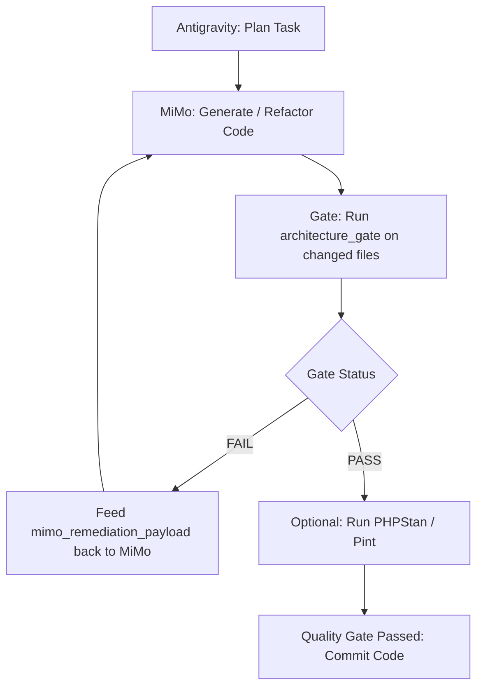

# Laravel Code Pattern MCP Server (v2.1.0)

Professional, enterprise-grade Model Context Protocol (MCP) quality gate and **Dynamic Relational Architecture Engine** for **Google Antigravity**, **Claude Desktop**, and **Cursor**.

Validates application code against the canonical Laravel architecture flow, enforces Dependency Inversion Principle (DIP), detects security risks (SQL injection, mass assignment, unauthorized mutations), audits multi-tenancy boundaries, and constructs directed dependency graphs without sending routine source code to an LLM:

```text
Controller -> FormRequest -> DTO -> Action -> optional Service -> RepositoryInterface -> Repository -> Eloquent Model -> Database
```

---

## ⚡ Design Principles & Capabilities

- **Dynamic Relational Architecture:** Constructs in-memory directed graphs (`INJECTS`, `CALLS`, `IMPLEMENTS`, `EXTENDS`, `CROSS_MODULE`) to trace call flows and detect cycle dependencies.
- **Dynamic Project Introspection:** Auto-detects project topology (Modular Monolith, Clean DDD, Standard Layered, Multi-Tenant SaaS) and dynamically merges custom `.laravel-pattern.json` overrides.
- **Strict Quality Gate:** Blocking `CRITICAL` and `ERROR` findings; non-blocking `WARNING` and `INFO` findings.
- **Multi-Tenancy Governance:** Strict separation between central and tenant migrations (`database/migrations/tenant/`) and prevention of unscoped tenant model queries.
- **OWASP Security Compliance:** Detects unescaped variable concatenation in raw SQL expressions (`DB::raw`, `whereRaw`), unguarded mass assignments (`$request->all()`), and unauthorized controller state mutations.
- **Dependency Inversion (DIP):** Mandates that Actions and Services depend on `RepositoryInterface` contracts rather than concrete persistence classes.
- **Static/AST-first:** No LLM tokens consumed for routine pattern checks.
- **Zero Dependencies:** Pure Node.js standard libraries (`readline`, `fs`, `child_process`).
- **High-Fidelity MiMo Remediation Payloads:** Automatically generates structured scaffolding and prompt instructions for MiMo when violations occur.
- **Environment Hot-Reloading:** Automatically reloads local `.env` settings upon modification without restarting the server.

---

## 🛠️ Configuration & Setup

### 1. Google Antigravity (`mcp_config.json`)
Open `mcp_config.json` (under Settings > Customizations > Open MCP Config):

```json
{
  "mcpServers": {
    "laravel-code-pattern": {
      "command": "node",
      "args": [
        "D:/mcp-collection/servers/laravel-code-pattern/server.js"
      ]
    }
  }
}
```

### 2. Claude Desktop (`claude_desktop_config.json`)
```json
{
  "mcpServers": {
    "laravel-code-pattern": {
      "command": "node",
      "args": [
        "/path/to/mcp-collection/servers/laravel-code-pattern/server.js"
      ]
    }
  }
}
```

### 3. Individual `.env` Configuration
The server automatically loads environment settings from its own local `.env` file (copied from `.env.example`). Modifications to `.env` hot-reload on the fly:

```env
# Primary Reviewer (Xiaomi MiMo)
LARAVEL_PATTERN_API_KEY=your_actual_key
LARAVEL_PATTERN_API_URL=https://api.xiaomimimo.com/v1/chat/completions
LARAVEL_PATTERN_MODEL=mimo-v2.6

# Fallback Reviewer (DeepSeek)
LARAVEL_PATTERN_FALLBACK_API_KEY=your_deepseek_key
LARAVEL_PATTERN_FALLBACK_API_URL=https://api.deepseek.com/v1/chat/completions
LARAVEL_PATTERN_FALLBACK_MODEL=deepseek-v4-flash
```

---

## 📦 Exposed MCP Tools

### 1. `architecture_gate`
Compact PASS/FAIL gate designed for the fast Antigravity $\leftrightarrow$ MiMo iteration loop.
- **Parameters:**
  - `files` (array, required): List of changed file paths (`string[]`) or objects (`{ path: string, content?: string }[]`).
  - `fail_on_warnings` (boolean, optional, default `false`): Fail the gate on warnings as well as errors.
  - `workspace_path` (string, optional): Path to workspace for dynamic config resolution.
  - `strict_mode` (boolean, optional): Enable strict architectural gate enforcement.
- **Returns:**
  - `status`: `"PASS"` or `"FAIL"`
  - `gate_decision`: `"PASS"` or `"BLOCK_AND_RETRY_MIMO"`
  - `health_score`: Calculated architectural health percentage (0-100%).
  - `executive_summary_markdown`: Executive Markdown report.
  - `violations`: Line-level violation items.
  - `mimo_remediation_payload`: Focused scaffolding ready to dispatch to MiMo.

### 2. `check_code_pattern`
Granular inspector for deep debugging, code reviews, and running optional external tooling (PHPStan/Pint/Pest).
- **Parameters:**
  - `files` (array, required): Files to inspect.
  - `rule_filter` (array, optional): Filter by specific rule IDs.
  - `include_external` (boolean, optional): Run local `phpstan`, `pint`, and `pest` if present.
  - `enable_semantic_review` (boolean, optional): Run conditional AI semantic review on clean code.

### 3. `get_architecture_rules`
Returns the project's canonical architecture contract, flow sequence, 20+ rule definitions, severities, and path conventions without scanning source code.

### 4. `analyze_project_architecture` (NEW)
Comprehensive project-wide architecture health inspection.
- **Parameters:**
  - `workspace_path` (string, optional): Project root path.
  - `max_files` (number, optional, default: 300): Maximum files to scan.
- **Returns:**
  - Full layer distribution and relational graph metrics.
  - Afferent / Efferent coupling and Instability indexes per component.
  - Multi-tenancy isolation compliance audit.
  - Interactive Mermaid architecture flowchart.

### 5. `explain_rule_remediation` (NEW)
Interactive architectural remediation guide for Laravel Clean Architecture rules.
- **Parameters:**
  - `rule_id` (string, required): E.g. `controller_direct_model`, `sql_injection_raw_exposure`, `repository_missing_interface`.
- **Returns:**
  - SOLID principle rationale.
  - Anti-Pattern code example (Before).
  - Canonical Refactored code example (After).

### 6. `validate_layer_contract` (NEW)
Validates whether a specific class adheres strictly to its layer contract (e.g. RepositoryInterface fulfillment for Repositories, single-purpose invokable contract for Actions, immutability for DTOs, authorization for Controllers).

---

## 📏 20+ Canonical Architecture Rules

| Rule ID | Severity | Category | Canonical Requirement |
| :--- | :---: | :---: | :--- |
| `controller_direct_model` | `ERROR` | Flow | Controllers must never import or query Eloquent Models directly. |
| `controller_direct_db` | `ERROR` | Flow | Controllers must never run raw SQL or use the `DB::` facade directly. |
| `controller_business_logic` | `WARNING` | Flow | Controller methods must remain thin ($\le 35$ lines, HTTP request $\to$ response mapping only). |
| `controller_unauthorized_mutation` | `ERROR` | Security | State-mutating controller methods (store, update, destroy) must enforce authorization via FormRequest or Policy checks. |
| `sql_injection_raw_exposure` | `CRITICAL` | Security | Unescaped variable concatenation or interpolation detected in raw SQL expressions (`DB::raw`, `whereRaw`). Parameterized bindings are mandatory. |
| `mass_assignment_unguarded` | `WARNING` | Security | Unvalidated `$request->all()` passed directly to `Model::create()` or `update()`. |
| `form_request_persistence` | `ERROR` | Flow | FormRequests must never execute database persistence (`save()`, `update()`, `delete()`). |
| `form_request_business_logic` | `WARNING` | Flow | FormRequests must only contain validation rules and authorization checks. |
| `dto_persistence` | `ERROR` | Flow | DTOs must be pure immutable value objects and never call the database. |
| `repository_http_dependency` | `ERROR` | Flow | Repositories must never import or depend on `Illuminate\Http\Request` or HTTP cookies/sessions. |
| `repository_business_logic` | `WARNING` | Flow | Repositories must handle only data retrieval and storage, not domain business logic. |
| `repository_missing_interface` | `WARNING` | Relational | Repositories must implement a corresponding `RepositoryInterface` / Contract (Dependency Inversion Principle). |
| `action_too_large` | `WARNING` | Flow | Actions must be single-purpose (preferably single `__invoke()` method, $\le$ 120 lines). |
| `action_http_dependency` | `ERROR` | Flow | Actions must be decoupled from the HTTP transport layer and receive typed DTOs or primitives instead of Request. |
| `service_too_large` | `WARNING` | Flow | Service classes should not exceed 350 lines; decompose into discrete Actions. |
| `cross_module_internal_dependency` | `ERROR` | Relational | Modules must communicate via Contracts or Events, never importing another module's internal Models/Repositories. |
| `tenant_migration_misplacement` | `ERROR` | MultiTenancy | Tenant-specific migrations must strictly reside in `database/migrations/tenant/`, not in the central migrations directory. |
| `tenant_unscoped_query` | `ERROR` | MultiTenancy | Multi-tenant models must use `BelongsToTenant` trait or explicit tenant scoping to prevent cross-tenant data leaks. |
| `n_plus_one_loop_query` | `WARNING` | Performance | Direct database queries or relationship calls detected inside loops (`foreach`/`while`). Use eager loading. |
| `unbounded_transaction_boundary` | `WARNING` | Reliability | Multiple database mutations across models without enclosing `DB::transaction()`. |
| `circular_dependency_detected` | `ERROR` | Relational | Circular dependency detected between classes in the relational graph. |

---

## 🔄 Recommended Antigravity + MiMo Loop


```mermaid
flowchart TD
    A["Antigravity: Plan Task"] --> B["MiMo: Generate / Refactor Code"]
    B --> C["Gate: Run architecture_gate on changed files"]
    C --> D{"Gate Status"}
    D -- "FAIL" --> E["Feed mimo_remediation_payload back to MiMo"]
    E --> B
    D -- "PASS" --> F["Optional: Run PHPStan / Pint"]
    F --> G["Quality Gate Passed: Commit Code"]
```

---

## 🤖 Antigravity Automated Enforcement Rule

To ensure Antigravity automatically and mandatorily enforces this quality gate on every coding task, bug fix, or refactor without manual prompts, the following rule is enforced in Antigravity's global rules (`AGENTS.md`):

```markdown
- **Auto Architecture Gate (Mandatory for Laravel)**: Always run `architecture_gate` from `laravel-code-pattern` on all modified Laravel files before Git commit. If `FAIL`, fix violations immediately and re-run. Never commit unless the gate returns `PASS`.
```

---

## 📄 License
MIT © MaccPro Team
